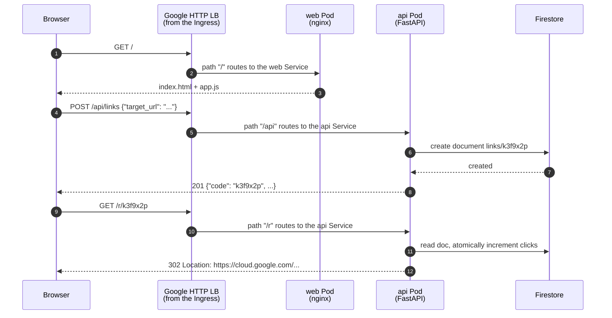

# Chapter 00 — Overview & Architecture

⏱ ~10 minutes, no commands to run. Read this before touching a terminal.

---

## 1. What we are building

**LinkForge** is a URL shortener. You paste `https://cloud.google.com/kubernetes-engine/docs/how-to/private-clusters`
into a box, it gives you back `http://34.120.55.10/r/k3f9x2p`, and when someone
clicks that short link they land on the original page while a counter ticks up.

That is the entire product. About 200 lines of Python and 150 lines of
JavaScript. It is small on purpose — you are here for the infrastructure, and
an app with interesting business logic would just get in the way.

## 2. What "3-tier" means

A three-tier architecture splits an application into three layers that can be
scaled, deployed and secured independently:

| Tier | Name | Job | In LinkForge |
|---|---|---|---|
| 1 | **Presentation** | Render the UI, talk to tier 2 | nginx serving static HTML/CSS/JS |
| 2 | **Application** | Business logic, the only thing allowed near the data | Python FastAPI microservice |
| 3 | **Data** | Store state durably | Firestore in Native mode |

The rule that makes it worth doing: **tier 1 never talks to tier 3.** The
browser has no database credentials, no database address, and no way to reach
Firestore even if it wanted to. Every read and write goes through the API,
which is where validation and authorisation live.

## 3. The request path, end to end

Follow a single click through the system. This is the mental model everything
else in the tutorial hangs off.

Two things to notice, because they explain design decisions later:

- **One hostname, three paths.** The load balancer routes by URL path, so the
  browser only ever talks to one origin. That is why the JavaScript can call
  `/api/links` as a relative path — there is no CORS to configure and no API
  hostname baked into the frontend image at build time. Change the IP and
  nothing in the code needs to change.
- **The Firestore call happens in step 5, inside the cluster.** The browser
  never appears on that line.

## 4. Every GCP service used, and why

| Service | Role here | Why this one |
|---|---|---|
| **GKE** (Kubernetes Engine) | Runs both application tiers | The industry default for containers, and the thing your Terraform skills most need to touch |
| **Artifact Registry** | Stores container images | Replaced Container Registry (`gcr.io`); regional, IAM-controlled |
| **Firestore** | Tier 3 data store | Serverless, generous free tier, pure-IAM access — no password to store |
| **Cloud Load Balancing** | The public front door | Created automatically by the Kubernetes Ingress object |
| **VPC + subnet** | Private network for nodes and Pods | Secondary ranges give Pods real routable IPs |
| **Private Google Access** | Lets IP-less nodes reach Google APIs | Saves ~$32/month by making Cloud NAT unnecessary |
| **IAM + Workload Identity** | Gives Pods a Google identity | So there is no key file inside any container |
| **Workload Identity Federation** | Lets GitHub Actions authenticate | So there is no key file in GitHub either |
| **Cloud Storage** | Terraform remote state | Shared, locked, versioned state |
| **Cloud Logging / Monitoring** | Where logs and metrics land | Free tier, zero configuration |

## 5. Decisions made for you, and what was rejected

Copy-pasting a tutorial teaches you very little unless you know what was on the
other side of each fork. Here is every meaningful choice in this lab.

| Decision | Chosen | Rejected | Reasoning |
|---|---|---|---|
| Data tier | Firestore | Cloud SQL for PostgreSQL | Cloud SQL needs a VPC peering, a private IP and a Cloud SQL Auth Proxy sidecar, costs ~$9/month, and adds a password to manage. Firestore is free here and lets Workload Identity shine. See §6 if you want to switch |
| Cluster mode | GKE **Standard**, zonal | GKE Autopilot | Standard makes you write `google_container_node_pool` yourself and lets you see, cordon and drain real nodes. Autopilot hides exactly the things you came to learn |
| Cluster location | Zonal (one zone) | Regional (three zones) | The GKE free tier covers the management fee for **one zonal** cluster. A regional cluster also triples the node count |
| Node VMs | 2 × `e2-small`, **Spot** | On-demand `e2-medium` | ~70% cheaper. Preemption is a free lesson in graceful shutdown |
| Node networking | **Private nodes**, no Cloud NAT | Public nodes, or private + NAT | Private nodes have no public IP (~$3.60/month each saved). Everything they talk to is a Google API, reachable free via Private Google Access. Trade-off: Pods cannot reach the public internet — pulling straight from Docker Hub will fail. That is a documented, deliberate constraint, with a one-line escape hatch |
| Control-plane endpoint | Public, IAM-protected | Private + bastion host | A private endpoint means GitHub-hosted runners cannot reach it without extra infrastructure. The endpoint still requires a valid Google identity |
| Ingress routing | One Ingress, path-based | Two Services of `type: LoadBalancer` | Two load balancers cost twice as much and force you to solve CORS |
| Image tags | Git commit SHA | `latest` | `latest` means two Pods can silently run different code and `rollout undo` has nothing to roll back to |
| CI/CD auth | Workload Identity Federation | Service account JSON key in a GitHub secret | A key is a permanent credential in a place you cannot audit. Federated tokens last minutes and are scoped to one repository |
| Pipelines | Two separate workflows | One workflow for everything | The deploy pipeline runs many times a day and must not be able to touch your VPC. Different service accounts, different permissions |
| Manifest templating | `sed` on placeholders | Helm or Kustomize | Both are better at scale, but both add a layer between you and the YAML. Learn the YAML first |
| Terraform layout | Modules + one root stack | One giant `main.tf` | Matches the `Azure/` and `AWS/` stacks already in this repository |

## 6. If you would rather use Cloud SQL

Nothing in chapters 01–04 or 07–12 changes. You would swap the Firestore
module for a Cloud SQL one, and specifically add:

1. A `google_compute_global_address` plus a `google_service_networking_connection` (VPC peering for private IP).
2. A `google_sql_database_instance` with `ipv4_enabled = false`.
3. The generated password in Secret Manager, mounted via the Secrets Store CSI driver.
4. A `cloud-sql-proxy` sidecar container in the API Deployment, authenticating with the same Workload Identity setup.
5. `roles/cloudsql.client` instead of `roles/datastore.user`.

Budget an extra ~$9/month and about 90 minutes. Finish this version first —
every other moving part will already be proven working, so you will be
debugging exactly one new thing.

## 7. What you will actually learn

By Chapter 12 you will have done, with your own hands:

- Written six reusable Terraform modules and wired them into a root stack
- Bootstrapped remote state and understood the chicken-and-egg problem it creates
- Built a VPC-native GKE cluster with private nodes, and understood why it needs no NAT
- Given a Pod a cloud identity with **zero** credentials in the container
- Given GitHub Actions a cloud identity with **zero** credentials in the repository
- Built and pushed container images, and understood why `latest` is a trap
- Routed one public IP to two services by path
- Written a pipeline that tests, builds, deploys and rolls itself back on failure
- Read logs and metrics, autoscaled under real load, drained a node, and rolled back a bad deploy
- Torn the whole thing down and confirmed the bill went to zero

That list is, more or less, the job description of a cloud/DevOps engineer.

---

> ✅ **Checkpoint** — You understand what you are building, how a request flows
> through it, and why each piece was chosen. Nothing has been created yet and
> nothing has been billed.

**Next:** [Chapter 01 — Prerequisites & your settings sheet](01-prerequisites.md)
