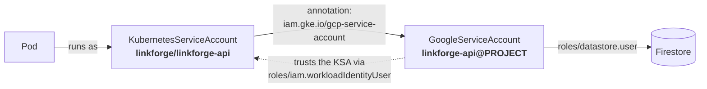

# Chapter 04 — Terraform: The Cluster

⏱ ~25 minutes, of which ~10 is Terraform creating the cluster. Good time for
a coffee, but read Step 4.2 while it runs — it is the most important concept
in the whole tutorial.

---

## Step 4.0 — What a GKE cluster actually is

**What we're doing.** Understanding the two halves before creating them.

A GKE cluster is two things that are billed and managed separately:

| | **Control plane** | **Nodes** |
|---|---|---|
| What | The Kubernetes API server, scheduler, etcd | Compute Engine VMs that run your Pods |
| Managed by | Google, entirely | Google patches them; you choose size and count |
| You see it as | An HTTPS endpoint `kubectl` talks to | `kubectl get nodes` |
| Cost | A flat management fee | Normal VM pricing |
| In Terraform | `google_container_cluster` | `google_container_node_pool` |

This is why `remove_default_node_pool = true` appears in the code below.
Terraform cannot create a cluster with zero node pools, so GKE makes a default
one, and we immediately throw it away and manage our own as a separate
resource. That separation means you can change machine types later by
replacing the node pool, instead of rebuilding the cluster.

**Three decisions that set your bill:**

1. **`location` is a zone, not a region.** `us-central1-a` gives a *zonal*
   cluster with one control plane. `us-central1` would give a *regional*
   cluster with three, spread across zones. Regional is what you want in
   production; here it triples your node count and is not covered by the free
   tier. GKE's free tier waives the **$74.40/month management fee for one
   zonal or Autopilot cluster per billing account** — so ours is $0.
2. **Spot nodes.** ~70% off, and Google can reclaim them with 30 seconds
   notice. For a lab that is a feature: you get to see Pods reschedule for
   free. Set `use_spot_nodes = false` if a preemption mid-demo would annoy you.
3. **30 GB `pd-standard` disks.** GKE defaults to **100 GB `pd-balanced`**,
   about $10/node/month. Our images total ~200 MB. This one variable saves
   roughly $18/month.

---

## Step 4.1 — The GKE module

**Create `GCP/modules/gke/variables.tf`:**

```hcl
variable "project_id" {
  description = "GCP project ID. Needed to build the Workload Identity pool name."
  type        = string
}

variable "cluster_name" {
  description = "Name of the GKE cluster."
  type        = string
}

variable "zone" {
  description = <<-EOT
    A single zone, e.g. "us-central1-a". Using a zone (not a region) creates a
    ZONAL cluster. That matters for money: GKE's free tier covers the
    $74.40/month control-plane management fee for ONE zonal or Autopilot
    cluster per billing account. A regional cluster is not covered.
  EOT
  type        = string
}

variable "network_id" { type = string }
variable "subnet_id" { type = string }

variable "pods_range_name" {
  description = "Name of the subnet secondary range used for Pod IPs."
  type        = string
}

variable "services_range_name" {
  description = "Name of the subnet secondary range used for Service ClusterIPs."
  type        = string
}

variable "node_count" {
  description = "Nodes in the primary pool. 2 lets you drain one node and watch Pods reschedule."
  type        = number
  default     = 2
}

variable "machine_type" {
  description = "Node machine type. e2-small (2 shared vCPU / 2 GB) is plenty for this lab."
  type        = string
  default     = "e2-small"
}

variable "use_spot_nodes" {
  description = <<-EOT
    Spot VMs cost ~70% less but Google can reclaim them with 30 seconds notice.
    For a learning lab that is a feature, not a bug: it is a free lesson in
    graceful shutdown and Pod rescheduling. Set to false if a preempted node
    mid-demo would annoy you.
  EOT
  type        = bool
  default     = true
}

variable "disk_size_gb" {
  description = "Node boot disk size. 30 GB pd-standard is the cheap end; the default of 100 GB pd-balanced would cost ~$10/node/month."
  type        = number
  default     = 30
}

variable "disk_type" {
  type    = string
  default = "pd-standard"
}

variable "master_ipv4_cidr_block" {
  description = "A /28 for the control plane's private endpoint. Must not overlap any other range."
  type        = string
  default     = "172.16.0.0/28"
}

variable "master_authorized_cidrs" {
  description = <<-EOT
    Who may reach the public control-plane endpoint. An EMPTY list (the default)
    means "anyone on the internet may reach the endpoint" -- they still need a
    valid Google identity and RBAC to do anything, but the endpoint answers.
    That is what lets GitHub-hosted runners (which have unpredictable IPs)
    run kubectl. Lock this down to your home IP once CI is not using it.
  EOT
  type = list(object({
    cidr = string
    name = string
  }))
  default = []
}

variable "release_channel" {
  description = "RAPID | REGULAR | STABLE. REGULAR is the sane default."
  type        = string
  default     = "REGULAR"
}

variable "node_service_account_email" {
  description = "Dedicated least-privilege service account for the nodes. Never use the default Compute Engine SA -- it has project Editor."
  type        = string
}

variable "resource_labels" {
  description = "Labels applied to the cluster, useful for billing breakdowns."
  type        = map(string)
  default     = {}
}
```

**Create `GCP/modules/gke/main.tf`:**

```hcl
# ---------------------------------------------------------------------------
# GKE Standard cluster (zonal, private nodes, VPC-native, Workload Identity)
# ---------------------------------------------------------------------------
resource "google_container_cluster" "this" {
  name     = var.cluster_name
  location = var.zone # a ZONE, not a region -> zonal cluster -> free tier applies

  network    = var.network_id
  subnetwork = var.subnet_id

  # Terraform cannot create a cluster with zero node pools, so GKE makes a
  # default one and we immediately throw it away and manage our own pool as a
  # separate resource. That separation lets us change machine types later
  # without recreating the whole cluster.
  remove_default_node_pool = true
  initial_node_count       = 1

  # VPC-native: Pods get real VPC IPs from the "pods" secondary range.
  # Required for container-native load balancing (NEGs), which our Ingress uses.
  networking_mode = "VPC_NATIVE"
  ip_allocation_policy {
    cluster_secondary_range_name  = var.pods_range_name
    services_secondary_range_name = var.services_range_name
  }

  # Private nodes: no external IPs on the VMs.
  #   - Saves ~$3.60/node/month in IPv4 charges.
  #   - Nodes still reach Artifact Registry / Firestore / Logging through
  #     Private Google Access (enabled on the subnet), so no Cloud NAT needed.
  #   - Trade-off: nodes CANNOT reach the public internet. Pulling an image
  #     straight from Docker Hub will fail with ImagePullBackOff. That is
  #     expected -- push it to Artifact Registry first.
  #
  # enable_private_endpoint = false keeps a PUBLIC control-plane endpoint so
  # your laptop and GitHub-hosted runners can run kubectl without a bastion.
  private_cluster_config {
    enable_private_nodes    = true
    enable_private_endpoint = false
    master_ipv4_cidr_block  = var.master_ipv4_cidr_block
  }

  dynamic "master_authorized_networks_config" {
    for_each = length(var.master_authorized_cidrs) > 0 ? [1] : []
    content {
      dynamic "cidr_blocks" {
        for_each = var.master_authorized_cidrs
        content {
          cidr_block   = cidr_blocks.value.cidr
          display_name = cidr_blocks.value.name
        }
      }
    }
  }

  # Workload Identity: the mechanism that lets a Kubernetes ServiceAccount
  # impersonate a Google service account. This is why there is not a single
  # credential file anywhere in this project.
  workload_identity_config {
    workload_pool = "${var.project_id}.svc.id.goog"
  }

  release_channel {
    channel = var.release_channel
  }

  addons_config {
    http_load_balancing {
      disabled = false # required for the GKE Ingress controller
    }
    horizontal_pod_autoscaling {
      disabled = false # required for the HPA in the Day-2 chapter
    }
  }

  logging_config {
    enable_components = ["SYSTEM_COMPONENTS", "WORKLOADS"]
  }

  monitoring_config {
    enable_components = ["SYSTEM_COMPONENTS"]
    managed_prometheus {
      enabled = false # keeps the metrics bill at zero for this lab
    }
  }

  # Free, and it makes per-namespace cost visible in the billing console.
  cost_management_config {
    enabled = true
  }

  resource_labels = var.resource_labels

  # The google provider defaults this to TRUE, and it will block
  # "terraform destroy" with a confusing error. For a lab, set it to false NOW
  # so teardown day is not a fight.
  deletion_protection = false
}

# ---------------------------------------------------------------------------
# Primary node pool
# ---------------------------------------------------------------------------
resource "google_container_node_pool" "primary" {
  name       = "primary"
  cluster    = google_container_cluster.this.id
  location   = var.zone
  node_count = var.node_count

  node_config {
    machine_type = var.machine_type
    disk_size_gb = var.disk_size_gb
    disk_type    = var.disk_type
    spot         = var.use_spot_nodes

    service_account = var.node_service_account_email
    # With a dedicated least-privilege SA the modern practice is to grant the
    # broad cloud-platform scope and let IAM roles do the actual restricting.
    oauth_scopes = ["https://www.googleapis.com/auth/cloud-platform"]

    # GKE_METADATA turns on the Workload Identity metadata server on the node
    # and BLOCKS Pods from reading the raw VM metadata endpoint. Without this,
    # any Pod could steal the node's service account token.
    workload_metadata_config {
      mode = "GKE_METADATA"
    }

    labels = {
      role = "app"
    }

    shielded_instance_config {
      enable_secure_boot          = true
      enable_integrity_monitoring = true
    }

    metadata = {
      disable-legacy-endpoints = "true"
    }
  }

  management {
    auto_repair  = true
    auto_upgrade = true
  }

  # max_surge = 1 / max_unavailable = 0 means upgrades add a node first, then
  # drain an old one. Zero downtime, one extra node's cost for a few minutes.
  upgrade_settings {
    max_surge       = 1
    max_unavailable = 0
  }

  lifecycle {
    ignore_changes = [
      # Node pool versions drift as GKE auto-upgrades. Ignoring this stops
      # every plan from showing a phantom change.
      version,
    ]
  }
}
```

**Create `GCP/modules/gke/outputs.tf`:**

```hcl
output "cluster_name" {
  value       = google_container_cluster.this.name
  description = "Cluster name, used by \"gcloud container clusters get-credentials\"."
}

output "cluster_location" {
  value       = google_container_cluster.this.location
  description = "Zone the cluster lives in."
}

output "cluster_endpoint" {
  value       = google_container_cluster.this.endpoint
  description = "Public IP of the Kubernetes API server."
  sensitive   = true
}

output "workload_identity_pool" {
  value       = "${var.project_id}.svc.id.goog"
  description = "The Workload Identity pool, used when binding KSAs to GSAs."
}

output "get_credentials_command" {
  value       = "gcloud container clusters get-credentials ${google_container_cluster.this.name} --zone ${google_container_cluster.this.location} --project ${var.project_id}"
  description = "Copy-paste this to point kubectl at the cluster."
}
```

**Four lines worth pausing on.**

`deletion_protection = false` — the Google provider defaults this to `true`.
Leave it and Chapter 12's `terraform destroy` fails with an error that reads
like a permissions problem. Setting it now, while you remember, saves a
confusing afternoon later.

`enable_private_nodes = true` with `enable_private_endpoint = false` — the
*nodes* are private (no public IPs, saving ~$3.60/month each), but the
*control plane* keeps a public endpoint. That endpoint still demands a valid
Google identity and RBAC; making it fully private would mean GitHub-hosted
runners could not reach it without a bastion host or a VPN, which is a lot of
extra infrastructure for a lab.

`master_authorized_cidrs` defaults to `[]`, which means "the endpoint answers
anyone who asks". That is what makes CI work, since GitHub-hosted runners have
unpredictable IPs. Once you stop using CI, lock it to your own address:

```hcl
master_authorized_cidrs = [
  { cidr = "203.0.113.7/32", name = "home" },  # curl -s ifconfig.me
]
```

`workload_metadata_config { mode = "GKE_METADATA" }` on the node pool — this
turns on the Workload Identity metadata server *and* blocks Pods from reading
the raw VM metadata endpoint. Without it, any Pod on the node could read the
node's own service account token and impersonate it. It is the line that makes
the next step actually secure rather than merely convenient.

---

## Step 4.2 — Workload Identity: the crown jewel

**What we're doing.** Giving a Kubernetes Pod a real Google Cloud identity,
with no credential file anywhere.

**Why this matters more than anything else in this tutorial.** The obvious way
to let a Pod talk to Firestore is:

1. Create a service account, download its JSON key.
2. Put the key in a Kubernetes Secret.
3. Mount it into the Pod, set `GOOGLE_APPLICATION_CREDENTIALS`.

That works, and it is how a great deal of production code still does it. It is
also a permanent credential that: sits in your cluster's etcd; appears in
`kubectl get secret -o yaml` for anyone with read access; gets copied into a
`.env` file when someone debugs locally; is committed to a private repo "just
temporarily"; and **never expires**. Leaked service account keys are one of the
most common serious cloud security incidents there is.

**Workload Identity removes the key entirely.** The chain:



When the Firestore client library inside the Pod asks for credentials, the GKE
metadata server intercepts it, checks the KSA's annotation, verifies the
Google service account trusts that KSA, and hands back a token that **expires
in an hour** and is automatically refreshed. Nothing is stored. Nothing can
leak. Revoking access is one IAM change.

**The two halves must agree exactly:**

| Half | Where | What it says |
|---|---|---|
| 1. Trust | Terraform, this module | Google SA `linkforge-api` grants `roles/iam.workloadIdentityUser` to `PROJECT.svc.id.goog[linkforge/linkforge-api]` |
| 2. Pointer | Kubernetes, Chapter 06 | KSA `linkforge-api` is annotated `iam.gke.io/gcp-service-account: linkforge-api@PROJECT.iam.gserviceaccount.com` |

Get either wrong — a typo in the namespace, the wrong project — and you get
**no error at deploy time**. Everything comes up green. Then the first
Firestore call returns 403. Remember this; it is the number one Workload
Identity support question, and Chapter 99 has the exact commands to debug it.

**Create `GCP/modules/workload-identity/variables.tf`:**

```hcl
variable "project_id" {
  type = string
}

variable "account_id" {
  description = "Google service account ID, e.g. \"linkforge-api\". Becomes linkforge-api@PROJECT.iam.gserviceaccount.com."
  type        = string
}

variable "display_name" {
  type    = string
  default = ""
}

variable "project_roles" {
  description = "Project-level IAM roles granted to this service account, e.g. [\"roles/datastore.user\"]."
  type        = list(string)
  default     = []
}

variable "kubernetes_namespace" {
  description = "Namespace of the Kubernetes ServiceAccount allowed to impersonate this Google SA."
  type        = string
}

variable "kubernetes_service_account" {
  description = "Name of the Kubernetes ServiceAccount allowed to impersonate this Google SA."
  type        = string
}
```

**Create `GCP/modules/workload-identity/main.tf`:**

```hcl
# ---------------------------------------------------------------------------
# Workload Identity: give a Kubernetes Pod a real Google identity
# ---------------------------------------------------------------------------
# The chain is:
#
#   Pod  --uses-->  KubernetesServiceAccount (KSA)
#                     |  annotated with the Google SA's email
#                     v
#                   GoogleServiceAccount (GSA)
#                     |  granted roles/datastore.user
#                     v
#                   Firestore
#
# Two halves have to line up or it silently fails with a 403:
#   1. HERE (Terraform): the GSA trusts the KSA via roles/iam.workloadIdentityUser
#   2. IN KUBERNETES: the KSA is annotated with iam.gke.io/gcp-service-account
#
# Result: no JSON key is ever created, downloaded, committed, or rotated.

resource "google_service_account" "this" {
  account_id   = var.account_id
  display_name = var.display_name != "" ? var.display_name : var.account_id
  description  = "Runtime identity for Pods using KSA ${var.kubernetes_namespace}/${var.kubernetes_service_account}"
}

resource "google_project_iam_member" "roles" {
  for_each = toset(var.project_roles)
  project  = var.project_id
  role     = each.value
  member   = "serviceAccount:${google_service_account.this.email}"
}

# The trust half. The member string format is exact and unforgiving:
#   serviceAccount:PROJECT_ID.svc.id.goog[NAMESPACE/KSA_NAME]
resource "google_service_account_iam_member" "workload_identity_user" {
  service_account_id = google_service_account.this.name
  role               = "roles/iam.workloadIdentityUser"
  member             = "serviceAccount:${var.project_id}.svc.id.goog[${var.kubernetes_namespace}/${var.kubernetes_service_account}]"
}
```

**Create `GCP/modules/workload-identity/outputs.tf`:**

```hcl
output "service_account_email" {
  description = "Put this in the KSA's iam.gke.io/gcp-service-account annotation."
  value       = google_service_account.this.email
}

output "ksa_annotation" {
  description = "The exact annotation line your Kubernetes ServiceAccount needs."
  value       = "iam.gke.io/gcp-service-account: ${google_service_account.this.email}"
}
```

> **Note on `roles/datastore.user`.** Firestore reuses the older Datastore IAM
> role names. `roles/datastore.user` is read + write on documents. There is no
> `roles/firestore.user`, and looking for one is a common five-minute detour.

---

## Step 4.3 — Add both modules to `main.tf`

**Do this.** Append this to `GCP/linkforge/main.tf`:

```hcl
# ---------------------------------------------------------------------------
# [Ch 04] GKE cluster
# ---------------------------------------------------------------------------
module "gke" {
  source = "../modules/gke"

  project_id   = var.project_id
  cluster_name = "${var.name_prefix}-gke"
  zone         = var.zone

  network_id          = module.network.network_id
  subnet_id           = module.network.subnet_id
  pods_range_name     = module.network.pods_range_name
  services_range_name = module.network.services_range_name

  node_count     = var.node_count
  machine_type   = var.machine_type
  use_spot_nodes = var.use_spot_nodes

  master_authorized_cidrs    = var.master_authorized_cidrs
  node_service_account_email = google_service_account.gke_nodes.email
  resource_labels            = local.common_labels

  depends_on = [google_project_service.required]
}

# ---------------------------------------------------------------------------
# [Ch 04] Workload Identity for the API Pods
# ---------------------------------------------------------------------------
# Creates linkforge-api@PROJECT.iam.gserviceaccount.com, grants it Firestore
# access, and lets the KSA linkforge/linkforge-api impersonate it.
module "api_workload_identity" {
  source = "../modules/workload-identity"

  project_id   = var.project_id
  account_id   = "${var.name_prefix}-api"
  display_name = "LinkForge API runtime identity"

  # roles/datastore.user is the read+write role for Firestore in Native mode.
  # (Firestore reuses the older Datastore IAM role names.)
  project_roles = ["roles/datastore.user"]

  kubernetes_namespace       = var.kubernetes_namespace
  kubernetes_service_account = var.api_service_account_name

  depends_on = [module.gke]
}
```

**Why `depends_on = [module.gke]` on the Workload Identity module.** The
`workload_pool` on the cluster has to exist before an IAM binding can
reference `PROJECT.svc.id.goog`. Nothing in the Workload Identity module
*references* the cluster, so Terraform would otherwise run them in parallel and
fail intermittently — the worst kind of failure, because it works on the retry
and you never learn why.

---

## Step 4.4 — Create the outputs file

**What we're doing.** Declaring the values you will need in later chapters, so
you can run one command instead of hunting through the console.

**Create `GCP/linkforge/outputs.tf`:**

```hcl
# ---------------------------------------------------------------------------
# Everything you need to copy into the next chapter, in one place.
# Run "terraform output" any time you lose your place.
# ---------------------------------------------------------------------------

output "project_id" {
  value = var.project_id
}

output "region" {
  value = var.region
}

# --- Chapter 04: point kubectl at the cluster ------------------------------
output "get_credentials_command" {
  description = "Run this to configure kubectl."
  value       = module.gke.get_credentials_command
}

output "cluster_name" {
  value = module.gke.cluster_name
}

# --- Chapter 05/06: build and push images ----------------------------------
output "registry_host" {
  description = "Use with: gcloud auth configure-docker <this> --quiet"
  value       = module.artifact_registry.registry_host
}

output "image_repo" {
  description = "Tag images as <this>/api:TAG and <this>/web:TAG"
  value       = module.artifact_registry.repository_url
}

# --- Chapter 06: annotate the Kubernetes ServiceAccount --------------------
output "api_google_service_account" {
  description = "Goes in the KSA's iam.gke.io/gcp-service-account annotation."
  value       = module.api_workload_identity.service_account_email
}
```

> The GitHub-related outputs come in Chapter 08, once the module that produces
> them exists.

---

## Step 4.5 — Plan and apply

**Do this.**

```bash
cd GCP/linkforge
terraform fmt -recursive ..
terraform validate
terraform plan
```

Expected: `Plan: 5 to add, 0 to change, 0 to destroy.` — two resources for the
cluster and node pool, three for the Workload Identity binding.

Then:

```bash
terraform apply
```

**What just happened.** This one takes **8–12 minutes**, almost all of it the
cluster. Terraform prints a `still creating... [1m0s elapsed]` line every ten
seconds; that is normal, not a hang.

In order: the cluster control plane is provisioned, then the node pool VMs
boot, join the cluster, and pull the GKE system images — which they do over
Private Google Access, with no public IP and no NAT. If that piece were
misconfigured, this is where you would find out, because the nodes would never
reach `Ready`.

Expected:

```
Apply complete! Resources: 5 added, 0 changed, 0 destroyed.

Outputs:

api_google_service_account = "linkforge-api@linkforge-lab-4821.iam.gserviceaccount.com"
cluster_name = "linkforge-gke"
get_credentials_command = "gcloud container clusters get-credentials linkforge-gke --zone us-central1-a --project linkforge-lab-4821"
image_repo = "us-central1-docker.pkg.dev/linkforge-lab-4821/linkforge"
...
```

---

## Step 4.6 — Point `kubectl` at the cluster

**What we're doing.** Writing a kubeconfig entry so `kubectl` knows where your
cluster is and how to authenticate to it.

**Do this.**

```bash
gcloud container clusters get-credentials "$CLUSTER_NAME" --zone "$ZONE" --project "$PROJECT_ID"
```

(That is exactly what the `get_credentials_command` output prints, if you would
rather copy it.)

**What just happened.** `gcloud` added a cluster, a user and a context to
`~/.kube/config` and made it your current context. The user entry does not
contain a password or a certificate — it runs `gke-gcloud-auth-plugin`, which
fetches a short-lived token from your gcloud credentials on every command.
That is why Step 1.1 insisted on installing it.

**Verify.**

```bash
kubectl config current-context
kubectl get nodes -o wide
```

Expected:

```
gke_linkforge-lab-4821_us-central1-a_linkforge-gke

NAME                                   STATUS   ROLES    AGE   VERSION          INTERNAL-IP   EXTERNAL-IP
gke-linkforge-gke-primary-a1b2c3d4-x9k Ready    <none>   3m    v1.30.x-gke.xxx  10.10.0.3     <none>
gke-linkforge-gke-primary-a1b2c3d4-p2m Ready    <none>   3m    v1.30.x-gke.xxx  10.10.0.4     <none>
```

Two things to notice, both of which prove earlier decisions worked:

- **`EXTERNAL-IP` is `<none>`.** Private nodes. No public IPs, no IPv4 charges.
- **`STATUS` is `Ready`.** The nodes pulled their system images and joined the
  control plane with no public internet route — Private Google Access doing
  exactly what it was configured for.

**Check the system Pods too:**

```bash
kubectl get pods -n kube-system
```

Every Pod should be `Running`. If any are `ImagePullBackOff`, Private Google
Access is not working — see Chapter 99.

**If it breaks.**

- *`gke-gcloud-auth-plugin was not found`* — Step 1.1. Install it, then re-run
  `get-credentials`.
- *`Unable to connect to the server: dial tcp ... i/o timeout`* — you set
  `master_authorized_cidrs` to something that does not include your current IP.
  Check with `curl -s ifconfig.me`.
- *Nodes stuck `NotReady`* — usually the node service account is missing
  `roles/logging.logWriter` or `roles/monitoring.metricWriter`. Check with
  `kubectl describe node NODE_NAME` and look at the events.
- *`Insufficient regional quota`* — new projects have low CPU quotas. Request
  more, or drop `node_count` to 1 in `terraform.tfvars`.

---

## What this now costs

The meter has started:

| | Per month |
|---|---|
| Control plane (zonal, free tier) | $0.00 |
| 2 × `e2-small` Spot | ~$7.70 |
| 2 × 30 GB `pd-standard` | ~$2.40 |
| **Total** | **~$10** |

Chapter 12 shows how to park this at near-zero between sessions.

---

> ✅ **Checkpoint** — You have a running GKE cluster with two private nodes,
> `kubectl` authenticated to it, and a Google service account waiting for a Pod
> to claim it. There is nothing deployed yet — that is the next two chapters.

**Next:** [Chapter 05 — The application](05-application-code.md)
