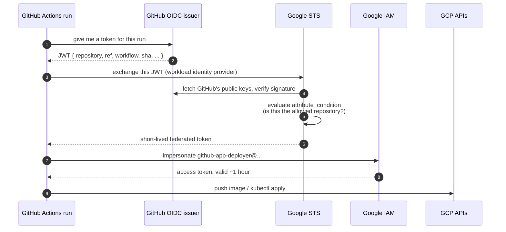

# Chapter 08 — Keyless CI/CD Authentication

⏱ ~20 minutes.

Before a pipeline can deploy anything, GitHub Actions has to prove to Google
who it is. This chapter is about doing that **without storing a credential**.

---

## Step 8.0 — The problem with the obvious approach

**What we're doing.** Understanding why we are not doing the simple thing.

The straightforward way to let GitHub Actions talk to GCP:

1. Create a service account.
2. Create a JSON key for it and download the file.
3. Paste the file contents into a GitHub secret.
4. Have the workflow write it to disk and point `GOOGLE_APPLICATION_CREDENTIALS` at it.

It works. It is also a **permanent credential** with these properties:

- It **never expires**. A key created today still works in 2031.
- It is copied into every fork, every CI log that accidentally echoes it, and
  every laptop where somebody debugged the pipeline locally.
- **You cannot tell whether it has leaked.** There is no usage attribution
  distinguishing "our pipeline" from "someone who found the key".
- Rotating it means updating every place it was copied to — which is why, in
  practice, almost nobody rotates.

You have already solved this once in this repository, for Azure: the
`k8s-cluster-infra-azure.yaml` workflow uses `ARM_USE_OIDC` and stores no
client secret. This is the same idea, and Google calls it **Workload Identity
Federation**.

---

## Step 8.1 — How the token exchange works



Nothing secret is stored anywhere. GitHub signs a statement about the run,
Google verifies that signature against GitHub's public keys, checks the
statement matches a condition **you** set, and issues a token that expires in
about an hour.

---

## Step 8.2 — The one line that makes this safe

**What we're doing.** Understanding `attribute_condition` before writing it,
because getting it wrong is a genuine security incident rather than an
inconvenience.

GitHub's OIDC issuer signs tokens for **every repository on GitHub**. The
signature being valid proves the token came from GitHub — it says nothing about
*which* repository. Without a condition restricting that, anyone could create a
public repo, run a workflow, get a validly-signed token, and impersonate your
service account.

This is not hypothetical; it was a widespread real-world misconfiguration.
Google now **refuses to create a provider without an `attribute_condition`**.

Ours pins it to exactly one repository:

```hcl
attribute_condition = "assertion.repository == 'YOUR_OWNER/le-terraform'"
```

**Two service accounts, not one.** The deploy pipeline runs many times a day
and needs to push images and roll out Deployments. The Terraform pipeline runs
rarely and needs to create VPCs, clusters and IAM bindings. Giving both jobs
the same identity means a compromised application deploy can delete your
network. Splitting them is the highest-value security decision in this lab and
costs about ten extra lines.

> The infrastructure service account gets `roles/editor` plus several admin
> roles, which is broad. That is a deliberate lab simplification, called out in
> the module's own comments. In production you would replace `roles/editor`
> with a curated list, or run infrastructure applies from a separate,
> tightly-controlled project.

---

## Step 8.3 — The GitHub OIDC module

**Create `GCP/modules/github-oidc/variables.tf`:**

```hcl
variable "project_id" {
  type = string
}

variable "project_number" {
  description = "Numeric project number (NOT the project ID). Needed to build the provider resource name GitHub Actions references."
  type        = string
}

variable "pool_id" {
  type    = string
  default = "github-pool"
}

variable "provider_id" {
  type    = string
  default = "github-provider"
}

variable "github_owner" {
  description = "GitHub user or org that owns the repo, e.g. \"SanjeevMurthy\"."
  type        = string
}

variable "github_repo" {
  description = "Repository name only, e.g. \"le-terraform\"."
  type        = string
}

variable "app_sa_roles" {
  description = "Roles for the DEPLOY pipeline SA. Deliberately narrow: push images, talk to the cluster."
  type        = list(string)
  default = [
    "roles/container.developer",
  ]
}

variable "infra_sa_roles" {
  description = <<-EOT
    Roles for the INFRASTRUCTURE pipeline SA. These are broad on purpose for a
    lab -- this SA creates VPCs, clusters, service accounts and IAM bindings.
    In production you would replace roles/editor with a curated list, or run
    infra applies from a separate, tightly controlled project.
  EOT
  type        = list(string)
  default = [
    "roles/editor",
    "roles/resourcemanager.projectIamAdmin",
    "roles/iam.serviceAccountAdmin",
    "roles/iam.workloadIdentityPoolAdmin",
    "roles/storage.admin",
    "roles/container.admin",
  ]
}
```

**Create `GCP/modules/github-oidc/main.tf`:**

```hcl
# ---------------------------------------------------------------------------
# Workload Identity Federation: GitHub Actions -> GCP, with no stored key
# ---------------------------------------------------------------------------
# This is the GCP equivalent of the Azure OIDC setup already in this repo.
#
# How it works:
#   1. GitHub Actions mints a short-lived OIDC token describing the run
#      (which repo, which branch, which workflow).
#   2. GCP's Security Token Service validates that token against GitHub's
#      public keys, checks our attribute_condition, and swaps it for a
#      federated token.
#   3. That federated token is used to impersonate a Google service account.
#
# Nothing secret is stored in GitHub. There is no JSON key to leak, and
# tokens expire in minutes.

resource "google_iam_workload_identity_pool" "github" {
  workload_identity_pool_id = var.pool_id
  display_name              = "GitHub Actions"
  description               = "Federated identities for GitHub Actions workflows"
}

resource "google_iam_workload_identity_pool_provider" "github" {
  workload_identity_pool_id          = google_iam_workload_identity_pool.github.workload_identity_pool_id
  workload_identity_pool_provider_id = var.provider_id
  display_name                       = "GitHub OIDC"

  # THE MOST IMPORTANT LINE IN THIS FILE.
  # Without an attribute_condition, ANY GitHub repository on the planet could
  # mint a token and assume your service account. Google now refuses to create
  # a provider without one. We pin it to exactly one repo.
  attribute_condition = "assertion.repository == '${var.github_owner}/${var.github_repo}'"

  # Map claims from GitHub's token into attributes we can write IAM conditions
  # against. attribute.repository is the one we bind on below.
  attribute_mapping = {
    "google.subject"             = "assertion.sub"
    "attribute.repository"       = "assertion.repository"
    "attribute.repository_owner" = "assertion.repository_owner"
    "attribute.ref"              = "assertion.ref"
    "attribute.workflow"         = "assertion.workflow"
  }

  oidc {
    issuer_uri = "https://token.actions.githubusercontent.com"
  }
}

# ---------------------------------------------------------------------------
# Two service accounts, because the two pipelines need very different power
# ---------------------------------------------------------------------------
# Splitting these means a compromised app-deploy workflow cannot delete your
# VPC. This is the single highest-value security decision in the whole lab.

resource "google_service_account" "app" {
  account_id   = "github-app-deployer"
  display_name = "GitHub Actions - application deploys"
  description  = "Builds images and rolls out Deployments. Cannot change infrastructure."
}

resource "google_service_account" "infra" {
  account_id   = "github-infra"
  display_name = "GitHub Actions - Terraform infrastructure"
  description  = "Runs terraform plan/apply/destroy."
}

resource "google_project_iam_member" "app_roles" {
  for_each = toset(var.app_sa_roles)
  project  = var.project_id
  role     = each.value
  member   = "serviceAccount:${google_service_account.app.email}"
}

resource "google_project_iam_member" "infra_roles" {
  for_each = toset(var.infra_sa_roles)
  project  = var.project_id
  role     = each.value
  member   = "serviceAccount:${google_service_account.infra.email}"
}

# ---------------------------------------------------------------------------
# The trust bindings: which federated principals may impersonate which SA
# ---------------------------------------------------------------------------
# principalSet://.../attribute.repository/OWNER/REPO means
# "any workflow run in this repository". You can tighten further to a single
# branch with attribute.ref -- see the commented example below.

locals {
  repo_principal = "principalSet://iam.googleapis.com/${google_iam_workload_identity_pool.github.name}/attribute.repository/${var.github_owner}/${var.github_repo}"
}

resource "google_service_account_iam_member" "app_wif" {
  service_account_id = google_service_account.app.name
  role               = "roles/iam.workloadIdentityUser"
  member             = local.repo_principal
}

resource "google_service_account_iam_member" "infra_wif" {
  service_account_id = google_service_account.infra.name
  role               = "roles/iam.workloadIdentityUser"
  member             = local.repo_principal

  # Tighter alternative -- only runs on the main branch may impersonate the
  # infrastructure SA. Requires attribute.ref in attribute_mapping (it is).
  #
  #   member = "principalSet://iam.googleapis.com/${google_iam_workload_identity_pool.github.name}/attribute.ref/refs/heads/main"
}
```

**Create `GCP/modules/github-oidc/outputs.tf`:**

```hcl
output "workload_identity_provider" {
  description = "Paste this into the workload_identity_provider input of google-github-actions/auth."
  value       = "projects/${var.project_number}/locations/global/workloadIdentityPools/${google_iam_workload_identity_pool.github.workload_identity_pool_id}/providers/${google_iam_workload_identity_pool_provider.github.workload_identity_pool_provider_id}"
}

output "app_service_account_email" {
  description = "Service account the application deploy workflow impersonates."
  value       = google_service_account.app.email
}

output "infra_service_account_email" {
  description = "Service account the Terraform workflow impersonates."
  value       = google_service_account.infra.email
}
```

**On `attribute_mapping`.** It copies claims out of GitHub's token into
attributes you can write IAM conditions against. We map `repository`,
`repository_owner`, `ref` and `workflow`. The binding below uses
`attribute.repository`; the commented-out alternative in the module shows how
to tighten further to a single branch using `attribute.ref` — worth doing once
this is working, so that only `main` can touch infrastructure.

---

## Step 8.4 — Wire it into `main.tf`

**Do this.** Append to `GCP/linkforge/main.tf`:

```hcl
# ---------------------------------------------------------------------------
# [Ch 08] Workload Identity Federation for GitHub Actions
# ---------------------------------------------------------------------------
module "github_oidc" {
  source = "../modules/github-oidc"

  project_id     = var.project_id
  project_number = data.google_project.this.number
  github_owner   = var.github_owner
  github_repo    = var.github_repo

  depends_on = [google_project_service.required]
}
```

**And now undo the temporary change from Chapter 03.** In the
`artifact_registry` module block, restore the real value:

```hcl
  # [Ch 08] Added once the GitHub OIDC module exists. Until then this is [].
  writer_members = ["serviceAccount:${module.github_oidc.app_service_account_email}"]
```

That grants the deploy service account `roles/artifactregistry.writer` **on
this one repository** rather than project-wide.

---

## Step 8.5 — Add the CI outputs

**Do this.** Append to `GCP/linkforge/outputs.tf`:

```hcl
# --- Chapter 08/09: GitHub repository variables ----------------------------
output "github_workload_identity_provider" {
  description = "GitHub repo variable: GCP_WORKLOAD_IDENTITY_PROVIDER"
  value       = module.github_oidc.workload_identity_provider
}

output "github_app_service_account" {
  description = "GitHub repo variable: GCP_APP_SERVICE_ACCOUNT"
  value       = module.github_oidc.app_service_account_email
}

output "github_infra_service_account" {
  description = "GitHub repo variable: GCP_INFRA_SERVICE_ACCOUNT"
  value       = module.github_oidc.infra_service_account_email
}

# --- A single block you can paste straight into GitHub ---------------------
output "github_variables_summary" {
  description = "All the GitHub repository variables you need, formatted for copy-paste."
  value       = <<-EOT

    Set these as GitHub repository VARIABLES (Settings > Secrets and variables
    > Actions > Variables). None of them are secret -- that is the whole point
    of Workload Identity Federation.

      GCP_PROJECT_ID                   = ${var.project_id}
      GCP_REGION                       = ${var.region}
      GCP_ZONE                         = ${var.zone}
      GKE_CLUSTER                      = ${module.gke.cluster_name}
      AR_REPOSITORY                    = ${var.artifact_repo_id}
      GCP_WORKLOAD_IDENTITY_PROVIDER   = ${module.github_oidc.workload_identity_provider}
      GCP_APP_SERVICE_ACCOUNT          = ${module.github_oidc.app_service_account_email}
      GCP_INFRA_SERVICE_ACCOUNT        = ${module.github_oidc.infra_service_account_email}
      TF_STATE_BUCKET                  = <the bucket you made in Chapter 02>

  EOT
}
```

The last output prints every value you need to paste into GitHub, formatted
and in one place, so you are not hunting through `terraform state show`.

---

## Step 8.6 — Apply

**Do this.**

```bash
cd GCP/linkforge
terraform fmt -recursive ..
terraform validate
terraform plan
terraform apply
```

Expected: `Plan: 14 to add, 0 to change, 0 to destroy.` then

```
Apply complete! Resources: 14 added, 0 changed, 0 destroyed.
```

Fast — about 30 seconds. IAM resources are cheap to create.

**Verify:**

```bash
gcloud iam workload-identity-pools list --location=global
gcloud iam workload-identity-pools providers describe github-provider \
  --location=global --workload-identity-pool=github-pool \
  --format="value(attributeCondition)"
```

Expected — and check the repository name is genuinely yours:

```
assertion.repository == 'YourName/le-terraform'
```

---

## Step 8.7 — Tell GitHub the values

**What we're doing.** Putting eight values into your repository so the
workflows can find them.

**Why variables and not secrets.** None of these are secret. A workload
identity provider path and a service account email are not credentials — they
are addresses. They are useless to anyone who cannot also produce a
GitHub-signed token for *your specific repository*. Using variables makes them
visible in logs, which makes debugging enormously easier.

That is the whole payoff of federation: **there is nothing to hide.**

**Do this.** Print everything at once:

```bash
cd GCP/linkforge
terraform output -raw github_variables_summary
```

Expected:

```
  GCP_PROJECT_ID                   = linkforge-lab-4821
  GCP_REGION                       = us-central1
  GCP_ZONE                         = us-central1-a
  GKE_CLUSTER                      = linkforge-gke
  AR_REPOSITORY                    = linkforge
  GCP_WORKLOAD_IDENTITY_PROVIDER   = projects/123456789/locations/global/workloadIdentityPools/github-pool/providers/github-provider
  GCP_APP_SERVICE_ACCOUNT          = github-app-deployer@linkforge-lab-4821.iam.gserviceaccount.com
  GCP_INFRA_SERVICE_ACCOUNT        = github-infra@linkforge-lab-4821.iam.gserviceaccount.com
  TF_STATE_BUCKET                  = <the bucket you made in Chapter 02>
```

Now add them to your repository:

**In the GitHub web UI:** *Settings → Secrets and variables → Actions →
Variables tab → New repository variable*, once per row. Do not use the Secrets
tab.

**Or with the `gh` CLI**, which is faster:

```bash
source ../../scripts/env.sh
cd GCP/linkforge

gh variable set GCP_PROJECT_ID   --body "$PROJECT_ID"
gh variable set GCP_REGION       --body "$REGION"
gh variable set GCP_ZONE         --body "$ZONE"
gh variable set GKE_CLUSTER      --body "$CLUSTER_NAME"
gh variable set AR_REPOSITORY    --body "$AR_REPO"
gh variable set TF_STATE_BUCKET  --body "$TF_STATE_BUCKET"
gh variable set GCP_WORKLOAD_IDENTITY_PROVIDER --body "$(terraform output -raw github_workload_identity_provider)"
gh variable set GCP_APP_SERVICE_ACCOUNT        --body "$(terraform output -raw github_app_service_account)"
gh variable set GCP_INFRA_SERVICE_ACCOUNT      --body "$(terraform output -raw github_infra_service_account)"
```

**Verify.**

```bash
gh variable list
```

Expected: nine variables. `TF_STATE_BUCKET` is easy to forget — check it is
there, because the Terraform workflow fails at `init` without it.

---

## Step 8.8 — Common failures (read this before Chapter 09)

You will not find out whether this worked until the first workflow run. When
it fails, the error is usually one of these three:

| Error in the Actions log | Cause | Fix |
|---|---|---|
| `Unable to acquire impersonated credentials` / `The caller does not have permission` | `attribute_condition` does not match your repo, or the `principalSet` binding is wrong | Confirm `git remote -v` matches `github_owner`/`github_repo` in `terraform.tfvars`, then re-apply |
| `Missing or insufficient OIDC token permissions` | The workflow lacks `id-token: write` | Add it to the `permissions:` block. Chapter 09's workflows have it |
| `denied: Permission "artifactregistry.repositories.uploadArtifacts"` | You did not restore `writer_members` in Step 8.4 | Restore that line and `terraform apply` |

**A useful debugging trick:** GitHub's OIDC token is a plain JWT. If a run
fails to authenticate, add this step temporarily to see what GitHub is actually
asserting:

```yaml
- name: Inspect the OIDC claims
  run: |
    TOKEN=$(curl -sH "Authorization: bearer $ACTIONS_ID_TOKEN_REQUEST_TOKEN" \
      "$ACTIONS_ID_TOKEN_REQUEST_URL&audience=https://github.com" | jq -r .value)
    echo "$TOKEN" | cut -d. -f2 | base64 -d 2>/dev/null | jq '{repository, ref, workflow}'
```

Compare the `repository` value it prints against your `attribute_condition`.
Nine times out of ten they differ by a capital letter or a typo.

> Remove that step once you have your answer. It prints claims, not the token
> itself, but there is no reason to leave introspection in a pipeline.

---

## What this cost

Nothing. IAM resources, workload identity pools and providers are all free.

---

> ✅ **Checkpoint** — Google Cloud trusts GitHub Actions running in your
> repository, and only yours. Two service accounts exist with deliberately
> different power. Nine variables are set in GitHub, and not one of them is a
> secret.

**Next:** [Chapter 09 — The pipelines](09-cicd-pipelines.md)
