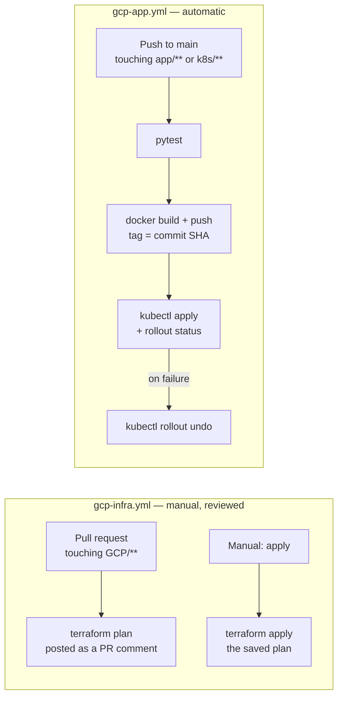

# Chapter 09 — The Pipelines

⏱ ~30 minutes.

Two workflows. One for infrastructure, one for the application, and the
separation between them is the lesson.

---

## Step 9.0 — Why two pipelines and not one

**What we're doing.** Deciding the shape before writing the YAML.

| | Infrastructure | Application |
|---|---|---|
| Changes | Rarely — weeks apart | Constantly — several times a day |
| Blast radius of a mistake | Delete a VPC, lose a cluster | A bad Deployment, rolled back in 60 seconds |
| Should it auto-apply on merge? | **No.** Manual trigger, with a plan you read first | **Yes.** That is the point |
| Needs | Terraform, broad IAM | Docker, `kubectl`, narrow IAM |
| Service account | `github-infra` | `github-app-deployer` |

One combined pipeline would force the daily deploy to run with the permissions
needed to destroy your network. Splitting them means a compromised or simply
buggy application deploy **cannot** touch infrastructure — not by policy, but
because the identity it runs as has no such permission.

That is defence in depth, and it costs one extra file.



---

## Step 9.1 — The infrastructure pipeline

**Create `.github/workflows/gcp-infra.yml`:**

````yaml
# ===========================================================================
# Terraform pipeline for the GCP LinkForge lab
# ===========================================================================
# Authenticates with Workload Identity Federation -- there is no service
# account JSON key stored in this repository. Compare with the Azure workflow
# in this repo: same idea, different cloud.
#
# Everything it needs lives in repository VARIABLES, not secrets, because none
# of it is secret. That is the entire point of federation.
#   Settings > Secrets and variables > Actions > Variables
name: GCP Infra (Terraform)

on:
  # Reviewing infrastructure changes before they land is the whole job.
  pull_request:
    paths:
      - "GCP/**"
      - ".github/workflows/gcp-infra.yml"

  workflow_dispatch:
    inputs:
      action:
        description: "What to run"
        required: true
        default: "plan"
        type: choice
        options:
          - plan
          - apply
          - destroy
          - list
      confirm_destroy:
        description: "Type DESTROY to confirm (only read for the destroy action)"
        required: false
        default: ""

permissions:
  contents: read
  id-token: write # REQUIRED: lets the job mint an OIDC token. Without it, auth fails.
  pull-requests: write # so the plan can be posted as a PR comment

env:
  TF_WORKING_DIR: GCP/linkforge
  TF_VERSION: "1.9.8"
  # Terraform reads TF_VAR_* automatically, which is tidier than a wall of
  # -var flags and keeps plan and apply guaranteed identical.
  TF_VAR_project_id: ${{ vars.GCP_PROJECT_ID }}
  TF_VAR_region: ${{ vars.GCP_REGION }}
  TF_VAR_zone: ${{ vars.GCP_ZONE }}
  TF_VAR_github_owner: ${{ github.repository_owner }}
  TF_VAR_github_repo: ${{ github.event.repository.name }}

jobs:
  # -------------------------------------------------------------------------
  # 1. Validate. Needs NO cloud credentials, so it runs for everyone from the
  #    very first commit -- including before you have finished Chapter 08 and
  #    set the GCP repository variables.
  # -------------------------------------------------------------------------
  validate:
    name: Validate (no credentials needed)
    runs-on: ubuntu-latest
    steps:
      - uses: actions/checkout@v4

      - uses: hashicorp/setup-terraform@v3
        with:
          terraform_version: ${{ env.TF_VERSION }}
          terraform_wrapper: false

      - name: Terraform fmt check
        run: terraform fmt -check -recursive GCP/

      # -backend=false downloads the providers and initialises the modules
      # WITHOUT touching the state bucket, so no credentials are needed. That
      # is what makes a real schema check possible on an unconfigured repo.
      - name: Terraform init (no backend)
        working-directory: ${{ env.TF_WORKING_DIR }}
        run: terraform init -backend=false -input=false

      # Checks every resource type, attribute and reference against the real
      # provider schema. Catches typos that fmt cannot see.
      - name: Terraform validate
        working-directory: ${{ env.TF_WORKING_DIR }}
        run: terraform validate

      - name: Report whether the cloud job will run
        env:
          WIF: ${{ vars.GCP_WORKLOAD_IDENTITY_PROVIDER }}
          BUCKET: ${{ vars.TF_STATE_BUCKET }}
        run: |
          if [ -n "$WIF" ] && [ -n "$BUCKET" ]; then
            echo "### Configuration found -- the plan/apply job will run." >> "$GITHUB_STEP_SUMMARY"
          else
            {
              echo "### Cloud steps skipped"
              echo
              echo "\`GCP_WORKLOAD_IDENTITY_PROVIDER\` and/or \`TF_STATE_BUCKET\` are not set"
              echo "as repository variables, so there is nothing to authenticate to yet."
              echo
              echo "This is expected until you finish **Chapter 08**. The formatting and"
              echo "schema validation above still ran, and still gate this pull request."
            } >> "$GITHUB_STEP_SUMMARY"
          fi

  # -------------------------------------------------------------------------
  # 2. Talk to Google Cloud. Skipped entirely until the repository variables
  #    from Chapter 08 exist -- a skipped job is a far better signal than an
  #    authentication error nobody can act on yet.
  # -------------------------------------------------------------------------
  terraform:
    name: terraform ${{ github.event.inputs.action || 'plan' }}
    runs-on: ubuntu-latest
    needs: validate
    if: vars.GCP_WORKLOAD_IDENTITY_PROVIDER != '' && vars.TF_STATE_BUCKET != ''

    steps:
      - name: Guard the destroy action
        if: github.event.inputs.action == 'destroy' && github.event.inputs.confirm_destroy != 'DESTROY'
        run: |
          echo "::error::Refusing to destroy. Re-run and type DESTROY in the confirmation box."
          exit 1

      - uses: actions/checkout@v4

      # Exchanges the run's OIDC token for short-lived Google credentials and
      # writes them where gcloud and the Terraform google provider find them
      # automatically. No key file is ever created on disk.
      - name: Authenticate to Google Cloud
        uses: google-github-actions/auth@v2
        with:
          workload_identity_provider: ${{ vars.GCP_WORKLOAD_IDENTITY_PROVIDER }}
          service_account: ${{ vars.GCP_INFRA_SERVICE_ACCOUNT }}

      - uses: google-github-actions/setup-gcloud@v2

      - uses: hashicorp/setup-terraform@v3
        with:
          terraform_version: ${{ env.TF_VERSION }}
          terraform_wrapper: false

      # The backend block in backend.tf is empty on purpose; the bucket is
      # supplied here. "prefix" is the folder inside the bucket, so several
      # stacks can share one bucket without colliding.
      - name: Terraform init
        working-directory: ${{ env.TF_WORKING_DIR }}
        run: |
          terraform init -input=false \
            -backend-config="bucket=${{ vars.TF_STATE_BUCKET }}" \
            -backend-config="prefix=linkforge"

      # ---------------------------------------------------------------------
      # plan (default for pull requests)
      # ---------------------------------------------------------------------
      - name: Terraform plan
        id: plan
        if: github.event_name == 'pull_request' || github.event.inputs.action == 'plan' || github.event.inputs.action == 'apply'
        working-directory: ${{ env.TF_WORKING_DIR }}
        run: |
          terraform plan -input=false -no-color -out=tfplan | tee plan.txt
          {
            echo 'summary<<PLAN_EOF'
            tail -c 60000 plan.txt
            echo 'PLAN_EOF'
          } >> "$GITHUB_OUTPUT"

      # The plan text is passed through an environment variable rather than
      # interpolated into the script body. Plan output can contain backticks
      # and ${...}, which would break -- or worse, execute inside -- a
      # JavaScript template literal.
      - name: Comment plan on the pull request
        if: github.event_name == 'pull_request'
        uses: actions/github-script@v7
        env:
          PLAN_TEXT: ${{ steps.plan.outputs.summary }}
        with:
          script: |
            const plan = process.env.PLAN_TEXT || '(no plan output)';
            const body = [
              '### Terraform plan',
              '',
              '<details><summary>Show plan</summary>',
              '',
              '```hcl',
              plan,
              '```',
              '',
              '</details>',
            ].join('\n');
            await github.rest.issues.createComment({
              issue_number: context.issue.number,
              owner: context.repo.owner,
              repo: context.repo.repo,
              body: body.slice(0, 65000),
            });

      # ---------------------------------------------------------------------
      # apply
      # ---------------------------------------------------------------------
      # Applies the SAVED plan file, not a fresh one. That guarantees what
      # runs is exactly what the plan step printed, with no window for the
      # world to change in between.
      - name: Terraform apply
        if: github.event.inputs.action == 'apply'
        working-directory: ${{ env.TF_WORKING_DIR }}
        run: terraform apply -input=false -auto-approve tfplan

      - name: Show outputs
        if: github.event.inputs.action == 'apply'
        working-directory: ${{ env.TF_WORKING_DIR }}
        run: terraform output

      # ---------------------------------------------------------------------
      # destroy
      # ---------------------------------------------------------------------
      - name: Terraform destroy
        if: github.event.inputs.action == 'destroy'
        working-directory: ${{ env.TF_WORKING_DIR }}
        run: terraform destroy -input=false -auto-approve

      # ---------------------------------------------------------------------
      # list -- a read-only "what do I actually own right now?"
      # ---------------------------------------------------------------------
      - name: Terraform state list
        if: github.event.inputs.action == 'list'
        working-directory: ${{ env.TF_WORKING_DIR }}
        run: terraform state list
````

**Six things in there worth understanding.**

**1. Two jobs, split by whether they need credentials.** The `validate` job
runs `terraform fmt -check`, `terraform init -backend=false` and `terraform
validate` — none of which touch Google Cloud. It therefore runs on *any* clone
of this repository, from the very first commit, before you have set a single
variable.

That matters twice over. Practically: if you open a pull request touching
`GCP/**` before finishing Chapter 08, you get a useful check instead of an
authentication error you cannot act on yet. Technically: `terraform validate`
after `init -backend=false` checks every resource type, attribute and reference
against the **real provider schema**, catching typos that `fmt` cannot see. It
is the single most valuable check in either pipeline and it costs nothing.

The `terraform` job below is gated on the variables actually existing:

```yaml
if: vars.GCP_WORKLOAD_IDENTITY_PROVIDER != '' && vars.TF_STATE_BUCKET != ''
```

Until Chapter 08 it simply shows as *skipped*, which is a far clearer signal
than a red cross.

**2. `permissions: id-token: write`.** Without this, `actions/checkout` runs
fine and then `google-github-actions/auth` fails with a message about a missing
OIDC token. It is the most common first-run failure, and it is one line.

**3. `TF_VAR_*` environment variables.** Terraform reads any variable named
`TF_VAR_project_id` into `var.project_id` automatically. Cleaner than a wall of
`-var` flags, and — more importantly — it guarantees `plan` and `apply` see
identical inputs, since both inherit the same job-level `env`.

**4. `github_owner` and `github_repo` come from the `github` context**, not
from variables you set. `${{ github.repository_owner }}` is always correct,
including in a fork, which removes a whole class of "I copied the wrong repo
name" failures.

**5. Apply uses the *saved plan file*.** `terraform plan -out=tfplan` then
`terraform apply tfplan`, in the same job. This guarantees that what runs is
exactly what the plan printed — no window in which the world changes between
the two. Your Azure workflow achieves the same thing by passing an artifact
between two jobs; doing it in one job is simpler and gives the same guarantee.

**6. The destroy guard.** `terraform destroy` is behind a text box you must
type `DESTROY` into. A dropdown where "destroy" sits one line below "apply" is
an accident waiting to happen, and this is a two-line fix.

> **On the PR-comment step:** the plan text is passed via an environment
> variable rather than interpolated into the JavaScript. Terraform output can
> contain backticks and `${...}`, which would break — or, worse, execute inside
> — a template literal. Never interpolate untrusted text straight into a
> `github-script` body.

---

## Step 9.2 — The application pipeline

**Create `.github/workflows/gcp-app.yml`:**

```yaml
# ===========================================================================
# Application pipeline: test -> build -> push -> deploy
# ===========================================================================
# Separate from the Terraform pipeline on purpose. Application code changes
# many times a day; infrastructure changes rarely and needs review. Splitting
# them means a routine deploy cannot accidentally touch your VPC, and the
# service account this workflow uses has no power to.
name: GCP App (build & deploy)

on:
  push:
    branches: [main]
    paths:
      - "app/**"
      - "k8s/**"
      - "scripts/deploy.sh"
      - ".github/workflows/gcp-app.yml"
  pull_request:
    paths:
      - "app/**"
      - "k8s/**"
      - ".github/workflows/gcp-app.yml"
  workflow_dispatch:
    inputs:
      tag:
        description: "Existing image tag to deploy (leave blank to build the current commit)"
        required: false
        default: ""

permissions:
  contents: read
  id-token: write

jobs:
  # -------------------------------------------------------------------------
  # 1. Test. Runs on every pull request, needs no cloud credentials at all.
  # -------------------------------------------------------------------------
  test:
    name: Unit tests
    runs-on: ubuntu-latest
    steps:
      - uses: actions/checkout@v4

      - uses: actions/setup-python@v5
        with:
          python-version: "3.12"
          cache: pip
          cache-dependency-path: app/api/requirements-dev.txt

      - name: Install dependencies
        working-directory: app/api
        run: pip install -r requirements-dev.txt

      - name: Run tests
        working-directory: app/api
        run: pytest -q

      - name: Report whether the deploy job will run
        env:
          WIF: ${{ vars.GCP_WORKLOAD_IDENTITY_PROVIDER }}
        run: |
          if [ -n "$WIF" ]; then
            echo "### Configuration found -- the deploy job will run." >> "$GITHUB_STEP_SUMMARY"
          else
            {
              echo "### Deploy skipped"
              echo
              echo "\`GCP_WORKLOAD_IDENTITY_PROVIDER\` is not set as a repository variable,"
              echo "so there is no cluster to deploy to yet. Expected until **Chapter 08**."
            } >> "$GITHUB_STEP_SUMMARY"
          fi

  # -------------------------------------------------------------------------
  # 2. Build, push and deploy. Only on main, and only if the tests passed.
  # -------------------------------------------------------------------------
  deploy:
    name: Build and deploy
    needs: test
    # Skipped until the Chapter 08 repository variables exist. A skipped job
    # is a much clearer signal to a half-configured repo than an auth error.
    if: >-
      (github.event_name == 'push' || github.event_name == 'workflow_dispatch')
      && vars.GCP_WORKLOAD_IDENTITY_PROVIDER != ''
    runs-on: ubuntu-latest

    env:
      PROJECT_ID: ${{ vars.GCP_PROJECT_ID }}
      REGION: ${{ vars.GCP_REGION }}
      ZONE: ${{ vars.GCP_ZONE }}
      CLUSTER_NAME: ${{ vars.GKE_CLUSTER }}
      AR_REPO: ${{ vars.AR_REPOSITORY }}
      NAMESPACE: linkforge

    steps:
      - uses: actions/checkout@v4

      # The image tag is the commit SHA. Immutable, traceable, and it makes
      # "which commit is in production?" a question with an actual answer.
      - name: Work out the image tag
        id: vars
        run: |
          TAG="${{ github.event.inputs.tag }}"
          if [ -z "$TAG" ]; then TAG="$(git rev-parse --short HEAD)"; fi
          echo "tag=$TAG" >> "$GITHUB_OUTPUT"
          echo "Deploying tag: $TAG"

      - name: Authenticate to Google Cloud
        uses: google-github-actions/auth@v2
        with:
          workload_identity_provider: ${{ vars.GCP_WORKLOAD_IDENTITY_PROVIDER }}
          # Note this is the APP service account, not the infra one. It can
          # push images and roll out Deployments, and nothing else.
          service_account: ${{ vars.GCP_APP_SERVICE_ACCOUNT }}

      - uses: google-github-actions/setup-gcloud@v2

      # Teaches Docker to send the short-lived Google credentials from the
      # step above when it talks to Artifact Registry.
      - name: Configure Docker for Artifact Registry
        run: gcloud auth configure-docker "${REGION}-docker.pkg.dev" --quiet

      - name: Build images
        env:
          TAG: ${{ steps.vars.outputs.tag }}
        run: |
          IMAGE_REPO="${REGION}-docker.pkg.dev/${PROJECT_ID}/${AR_REPO}"
          docker build -t "${IMAGE_REPO}/api:${TAG}" app/api
          docker build -t "${IMAGE_REPO}/web:${TAG}" app/web

      - name: Push images
        env:
          TAG: ${{ steps.vars.outputs.tag }}
        run: |
          IMAGE_REPO="${REGION}-docker.pkg.dev/${PROJECT_ID}/${AR_REPO}"
          docker push "${IMAGE_REPO}/api:${TAG}"
          docker push "${IMAGE_REPO}/web:${TAG}"

      # Writes a kubeconfig that authenticates with the same federated
      # credentials. No cluster password, no downloaded certificate.
      - name: Get GKE credentials
        uses: google-github-actions/get-gke-credentials@v2
        with:
          cluster_name: ${{ vars.GKE_CLUSTER }}
          location: ${{ vars.GCP_ZONE }}

      - name: Deploy
        env:
          TAG: ${{ steps.vars.outputs.tag }}
        run: |
          export IMAGE_REPO="${REGION}-docker.pkg.dev/${PROJECT_ID}/${AR_REPO}"
          export API_GSA_EMAIL="linkforge-api@${PROJECT_ID}.iam.gserviceaccount.com"
          ./scripts/deploy.sh "${TAG}"

      # deploy.sh runs "kubectl rollout status", which fails the step if the
      # new Pods never become Ready. Because maxUnavailable is 0, the old
      # Pods are still serving at that point -- so this rollback returns the
      # Deployment to a known-good state without any downtime having occurred.
      - name: Roll back if the rollout failed
        if: failure()
        run: |
          echo "::warning::Rollout failed, rolling back"
          kubectl rollout undo deployment/api -n "${NAMESPACE}" || true
          kubectl rollout undo deployment/web -n "${NAMESPACE}" || true
          kubectl get pods -n "${NAMESPACE}"

      - name: Show the public URL
        if: success()
        run: |
          IP=$(kubectl get ingress linkforge -n "${NAMESPACE}" \
                 -o jsonpath='{.status.loadBalancer.ingress[0].ip}' 2>/dev/null || true)
          if [ -n "$IP" ]; then
            echo "### LinkForge is live at http://${IP}" >> "$GITHUB_STEP_SUMMARY"
          else
            echo "### Deployed. Ingress has no IP yet (it takes a few minutes on first creation)." >> "$GITHUB_STEP_SUMMARY"
          fi
```

**Five things worth understanding.**

**1. The `test` job needs no cloud credentials.** It runs on every pull
request, in about 20 seconds, and it gates the deploy job via `needs: test`.
A pipeline that only builds and deploys teaches you to skip the step that
catches problems while they are still cheap.

**2. The image tag is the commit SHA**, computed once and reused for build,
push and deploy. Every running Pod is traceable to exactly one commit.

**3. `deploy.sh` is the same script you ran by hand in Chapter 06.** Not a
reimplementation of it. When CI and local development share a script, "works on
my machine" and "works in CI" stop being different states — and you can debug
CI failures locally.

**4. The `deploy` job carries the same gate as the Terraform pipeline** —
`vars.GCP_WORKLOAD_IDENTITY_PROVIDER != ''`. Push application changes before
Chapter 08 and the tests still run and still tell you something useful; only
the deploy is skipped, with a line in the run summary saying why.

**5. The rollback step is safe because of `maxUnavailable: 0`.**
`deploy.sh` ends with `kubectl rollout status`, which fails the step if the new
Pods never become Ready. At that moment the **old Pods are still serving**,
because the rollout strategy never removes an old Pod before a new one is
Ready. So `rollout undo` returns to a known-good state without any downtime
having occurred at all.

---

## Step 9.3 — Commit and push

**Do this.**

```bash
cd /path/to/le-terraform
git add .
git commit -m "Add GCP 3-tier LinkForge lab: Terraform, app, k8s, CI/CD"
git push -u origin main
```

**What just happened.** The push touched `app/**` and `k8s/**`, so the
`gcp-app.yml` workflow triggered. Watch it:

```bash
gh run watch
```

or open the **Actions** tab in your repository.

---

## Step 9.4 — Read the first run

**Expected sequence**, roughly 3–5 minutes total:

| Job | Step | ~Time |
|---|---|---|
| `test` | Install dependencies, `pytest -q` → `12 passed` | 30s |
| | (In the Terraform pipeline, `validate` runs `fmt`/`init`/`validate` in parallel) | 40s |
| `deploy` | Authenticate to Google Cloud | 5s |
| | Configure Docker for Artifact Registry | 3s |
| | Build images | 90s |
| | Push images | 40s |
| | Get GKE credentials | 10s |
| | Deploy (`deploy.sh` → apply + rollout status) | 60s |
| | Show the public URL | 2s |

**Verify:**

```bash
curl -s "http://${LINKFORGE_IP}/api/version"; echo
git rev-parse --short HEAD
```

The `version` in the JSON should equal your commit SHA. That is the pipeline
proving it deployed *this* commit.

Also check the run summary at the bottom of the Actions page — the last step
writes the live URL into `$GITHUB_STEP_SUMMARY`.

**If it breaks.**

| Symptom | Cause | Fix |
|---|---|---|
| `Unable to acquire impersonated credentials` | Provider path or `attribute_condition` mismatch | Chapter 08, Step 8.8 |
| `denied: ... uploadArtifacts` | `writer_members` still `[]` | Chapter 08, Step 8.4, then re-apply |
| `error: You must be logged in to the server` | `GKE_CLUSTER` or `GCP_ZONE` variable wrong or missing | `gh variable list` |
| `Error from server (NotFound): namespaces "linkforge" not found` | Nothing ever applied `00-namespace.yaml` | Run `./scripts/deploy.sh` locally once |
| Rollout times out, then rolls back | New image genuinely broken | `kubectl logs -n linkforge -l tier=api --previous` |

---

## Step 9.5 — Try the infrastructure pipeline

**What we're doing.** Confirming Terraform runs in CI, without changing
anything.

**Do this.** Actions tab → **GCP Infra (Terraform)** → *Run workflow* → action
`plan` → *Run workflow*.

**Expected**, at the end of the plan step:

```
No changes. Your infrastructure matches the configuration.
```

That is the correct and satisfying result. Terraform ran in CI, as a federated
identity, read the state you created from your laptop, compared it against
reality, and found them identical.

**Now try the read-only inventory.** Run it again with action `list`:

```
data.google_project.this
google_project_iam_member.gke_nodes["roles/logging.logWriter"]
google_service_account.gke_nodes
module.artifact_registry.google_artifact_registry_repository.docker
module.firestore.google_firestore_database.default
module.github_oidc.google_iam_workload_identity_pool.github
module.gke.google_container_cluster.this
module.gke.google_container_node_pool.primary
module.network.google_compute_network.vpc
module.network.google_compute_subnetwork.nodes
...
```

Every resource you own, in one list. This is the fastest way to answer "what is
actually running?" — and worth checking before every teardown.

---

## Step 9.6 — Optional: require a plan review

The infrastructure pipeline posts its plan as a pull request comment. To make
that a real gate rather than a courtesy:

1. *Settings → Branches → Add branch protection rule* for `main`.
2. Enable **Require a pull request before merging**.
3. Enable **Require status checks to pass** and select the `terraform` check.

Now infrastructure changes cannot reach `main` without someone reading a plan
first — which is how it works on real teams, and why the plan-as-a-comment step
exists at all.

---

> ✅ **Checkpoint** — Two pipelines, authenticating with no stored
> credentials, running as two different identities with different powers. Tests
> gate deploys, deploys roll themselves back, and infrastructure changes are
> planned and reviewed rather than applied blindly.

**Next:** [Chapter 10 — Prove it end to end](10-end-to-end-proof.md)
