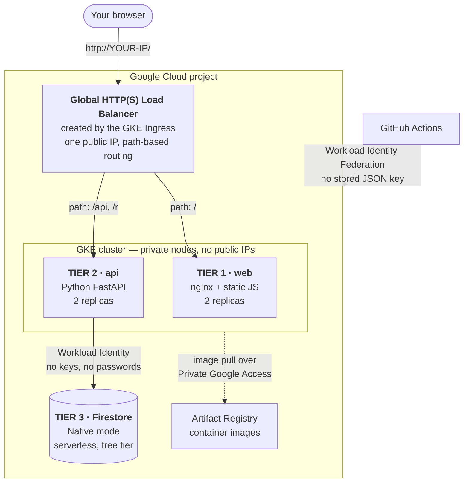

# Build a 3-Tier Application on GCP — End to End

A hands-on tutorial that takes you from an empty Google Cloud project to a
working, publicly reachable, three-tier application deployed by a CI/CD
pipeline — with every piece of infrastructure defined in Terraform.

You will build **LinkForge**, a URL shortener. The app is deliberately small.
The infrastructure around it is the point.

---

## What you end up with



A real URL shortener: paste a long link, get `http://YOUR-IP/r/a7f3k9x` back,
click it, watch the counter go up. Then change one line of code, `git push`,
and watch the version number in the footer change three minutes later without
you touching a terminal.

---

## The chapters

Work through them in order. Each one ends in a state you can stop at.

| # | Chapter | You end up with | Time |
|---|---------|-----------------|------|
| [00](00-overview.md) | **Overview & architecture** | Understanding the whole map before step 1 | 10 min |
| [01](01-prerequisites.md) | **Prerequisites & your settings sheet** | Tools installed, `scripts/env.sh` filled in | 20 min |
| [02](02-bootstrap.md) | **Bootstrap the project** | GCP project, APIs on, Terraform state bucket | 15 min |
| [03](03-terraform-foundation.md) | **Terraform: the foundation** | VPC, Artifact Registry, Firestore — first `apply` | 30 min |
| [04](04-terraform-gke.md) | **Terraform: the cluster** | A running GKE cluster, `kubectl` working | 25 min |
| [05](05-application-code.md) | **The application** | LinkForge running on your laptop, tests passing | 30 min |
| [06](06-manual-build-and-deploy.md) | **Build and deploy by hand** | Your images in Artifact Registry, Pods running in GKE | 25 min |
| [07](07-ingress-go-live.md) | **Go live with an Ingress** | A public URL that actually works | 20 min |
| [08](08-github-workload-identity-federation.md) | **Keyless CI/CD auth** | GitHub trusted by GCP, no secrets stored | 20 min |
| [09](09-cicd-pipelines.md) | **The pipelines** | Two GitHub Actions workflows | 30 min |
| [10](10-end-to-end-proof.md) | **Prove it end to end** | A code change reaching production on its own | 15 min |
| [11](11-day2-operations.md) | **Day 2: run it** | Logs, autoscaling, rollback, node drain | 45 min |
| [12](12-cost-control-and-teardown.md) | **Cost control & teardown** | Back to roughly $0/month | 15 min |
| [98](98-glossary.md) | Glossary | Every term used, in plain English | — |
| [99](99-troubleshooting.md) | Troubleshooting index | The errors you will actually hit | — |

**Roughly 5 hours of focused work.** Chapters 03, 04 and 07 include waits
(Terraform provisioning, the load balancer coming up) where you get coffee.

---

## How each step is written

Every step follows the same shape, so you always know where to look:

> **What we're doing** — one paragraph of plain English, no jargon.
>
> **Why this way** — the decision made and the alternative rejected. This is
> the part that turns copy-paste into understanding.
>
> **Do this** — the exact file to create or command to run. Complete, never
> abbreviated, never with `...` standing in for something you have to guess.
>
> **What just happened** — what the output means and how long it took.
>
> **Verify** — a command, and the output you should see. If yours differs,
> stop here rather than moving on.
>
> **If it breaks** — the two or three failures that actually happen at this
> step.
>
> ✅ **Checkpoint** — what you now have.

---

## Money

This lab is built to be cheap, because a learning project that quietly bills
you $200 is not a learning project.

| Thing | Monthly cost | Why |
|---|---|---|
| GKE control plane | **$0** | Free tier covers one zonal cluster's management fee |
| 2 × `e2-small` Spot nodes | ~$8 | Spot pricing, minimum viable size |
| 2 × 30 GB `pd-standard` disks | ~$1 | Down from the 100 GB `pd-balanced` default |
| Firestore | **$0** | 1 GiB, 50k reads/day, 20k writes/day free |
| Artifact Registry | **~$0** | 0.5 GB free; a cleanup policy keeps us under it |
| Cloud Storage (state) | **$0** | State files are kilobytes |
| Cloud Logging | **$0** | 50 GiB/month free |
| Node public IPs | **$0** | Private nodes have none |
| Cloud NAT | **$0** | Not used — Private Google Access does the job free |
| **HTTP Load Balancer (Ingress)** | **~$18** | The one real cost. Chapter 12 shows the off switch |

**≈ $9/month parked, ≈ $27/month with the public URL live.** New Google Cloud
accounts get $300 in credits, which covers this comfortably.

Chapter 12 has both a "park it" mode (scale to zero, delete the Ingress, keep
everything else) and a full teardown.

---

## Prior knowledge assumed

You should be comfortable with a terminal, `git`, and the basic idea of
Terraform (`init` / `plan` / `apply`). You do **not** need to know Kubernetes,
GCP, Python or nginx — every one of those is explained where it first appears.

## The finished code

Everything you build lives in this repository, so if a step goes wrong you can
diff against a working copy:

```
GCP/modules/        six Terraform modules
GCP/linkforge/      the root stack you run terraform in
app/api/            the FastAPI microservice + its tests
app/web/            the static frontend + nginx config
k8s/                Kubernetes manifests
scripts/            build, deploy and load-test helpers
.github/workflows/  gcp-infra.yml and gcp-app.yml
```

Start with **[Chapter 00 — Overview](00-overview.md)**.
